```mermaid
graph TB
    subgraph Internet["インターネット"]
        Users[ユーザー]
    end

    subgraph AWS["AWS Cloud - VPC"]
        subgraph PublicSubnets["Public Subnets"]
            ALB[Application Load<br/>Balancer]
        end
        
        subgraph PrivateSubnets["Private Subnets"]
            ASG[Auto Scaling Group<br/>Min: 1, Max: 4]
            EC2_1[EC2 Instance 1]
            EC2_2[EC2 Instance 2]
            EC2_N[EC2 Instance N]
        end
        
        TG[Target Group<br/>Health Check: /health.html]
        LT[Launch Template<br/>t3.small + Apache]
        SP[Scaling Policy<br/>Target: CPU 70%]
        
        ALBSG[ALB Security Group<br/>Port 80]
        WebSG[Web Security Group<br/>Port 80 from ALB]
    end

    Users -->|HTTP| ALB
    ALB -->|Port 80| TG
    TG --> EC2_1
    TG --> EC2_2
    TG --> EC2_N
    
    ASG -.->|起動| LT
    ASG --> EC2_1
    ASG --> EC2_2
    ASG --> EC2_N
    SP -.->|スケール| ASG
    
    ALB -.->|SG| ALBSG
    EC2_1 -.->|SG| WebSG
    EC2_2 -.->|SG| WebSG
    EC2_N -.->|SG| WebSG

    classDef awsBlue fill:#3b48cc,stroke:#232f3e,color:#fff
    classDef awsOrange fill:#ff9900,stroke:#232f3e,color:#fff
    classDef awsPink fill:#d9208c,stroke:#232f3e,color:#fff
    classDef awsGreen fill:#3f8624,stroke:#232f3e,color:#fff
    
    class ALB,TG awsPink
    class EC2_1,EC2_2,EC2_N awsOrange
    class ASG,SP awsGreen
```

```mermaid
graph LR
    subgraph Internet["インターネット"]
        Users[ユーザー]
    end

    subgraph AWS["AWS Cloud - サーバーレス"]
        APIGW[API Gateway<br/>GET /hello]
        Lambda[Lambda Function<br/>Python 3.11<br/>Hello World]
        CWLogs[CloudWatch Logs]
        IAM[IAM Role<br/>Lambda Execution]
    end

    Users -->|HTTPS GET| APIGW
    APIGW -->|トリガー| Lambda
    Lambda -->|実行| IAM
    Lambda -.->|ログ出力| CWLogs

    classDef awsBlue fill:#3b48cc,stroke:#232f3e,color:#fff
    classDef awsOrange fill:#ff9900,stroke:#232f3e,color:#fff
    classDef awsRed fill:#dd344c,stroke:#232f3e,color:#fff
    classDef awsPurple fill:#8c4fff,stroke:#232f3e,color:#fff
    
    class APIGW awsPurple
    class Lambda awsOrange
    class CWLogs awsRed
    class IAM awsRed
```

```mermaid
graph TB
    subgraph Internet["インターネット"]
        Users[ユーザー]
    end

    subgraph AWS["AWS Cloud"]
        subgraph Edge["エッジロケーション（グローバル）"]
            CF[CloudFront<br/>Distribution]
            OAC[Origin Access<br/>Control]
        end
        
        subgraph Storage["ap-northeast-1"]
            S3[S3 Bucket<br/>静的コンテンツ<br/>index.html]
            Policy[Bucket Policy<br/>CloudFrontのみ許可]
        end
    end

    Users -->|HTTPS<br/>グローバル高速配信| CF
    CF -->|OAC認証| OAC
    OAC -->|GetObject| S3
    Policy -.->|制御| S3

    classDef awsBlue fill:#3b48cc,stroke:#232f3e,color:#fff
    classDef awsOrange fill:#ff9900,stroke:#232f3e,color:#fff
    classDef awsGreen fill:#3f8624,stroke:#232f3e,color:#fff
    classDef awsPurple fill:#8c4fff,stroke:#232f3e,color:#fff
    
    class CF awsPurple
    class S3 awsGreen
    class OAC awsOrange
```

```mermaid
graph TB
    subgraph AWS["AWS Cloud - VPC"]
        subgraph AZ1["Availability Zone 1"]
            subgraph PrivateSubnet1["Private Subnet 1"]
                Primary[RDS Primary<br/>MySQL 8.0<br/>db.r6i.large]
            end
        end
        
        subgraph AZ2["Availability Zone 2"]
            subgraph PrivateSubnet2["Private Subnet 2"]
                Standby[RDS Standby<br/>MySQL 8.0<br/>自動フェイルオーバー]
            end
        end
        
        subgraph AZ3["Availability Zone 3"]
            subgraph PrivateSubnet3["Private Subnet 3"]
                Replica[Read Replica<br/>MySQL 8.0<br/>db.r6i.large<br/>読み取り専用]
            end
        end
        
        KMS[KMS Key<br/>暗号化]
        DBSG[DB Security Group]
        SubnetGroup[DB Subnet Group]
        CWLogs[CloudWatch Logs<br/>error/slowquery]
        PI[Performance<br/>Insights]
    end
    
    subgraph App["アプリケーション層"]
        AppWrite[書き込み処理]
        AppRead[読み取り処理]
    end

    Primary -.->|同期レプリケーション| Standby
    Primary -->|非同期レプリケーション| Replica
    Primary -.->|暗号化| KMS
    Primary -.->|SG| DBSG
    Primary -.->|配置| SubnetGroup
    Primary -.->|ログ| CWLogs
    Primary -.->|監視| PI
    
    AppWrite -->|Write| Primary
    AppRead -->|Read| Replica
    
    Standby -.->|フェイルオーバー時<br/>Primaryに昇格| Primary

    classDef awsBlue fill:#3b48cc,stroke:#232f3e,color:#fff
    classDef awsOrange fill:#ff9900,stroke:#232f3e,color:#fff
    classDef awsRed fill:#dd344c,stroke:#232f3e,color:#fff
    classDef awsPurple fill:#8c4fff,stroke:#232f3e,color:#fff
    classDef awsGreen fill:#3f8624,stroke:#232f3e,color:#fff
    
    class Primary,Standby,Replica awsPurple
    class KMS awsRed
    class CWLogs,PI awsRed
```

```mermaid
graph LR
    subgraph App["アプリケーション"]
        Client[クライアント<br/>アプリ]
    end

    subgraph AWS["AWS Cloud"]
        subgraph DataLayer["データレイヤー"]
            DDB[(DynamoDB Table<br/>users<br/>PAY_PER_REQUEST)]
            Stream[DynamoDB Stream<br/>NEW_AND_OLD_IMAGES]
            PITR[Point-in-Time<br/>Recovery]
            SSE[暗号化<br/>SSE]
        end
        
        subgraph ProcessingLayer["処理レイヤー"]
            Lambda[Lambda Function<br/>Stream Processor<br/>Python 3.11]
            ESM[Event Source<br/>Mapping]
            IAM[IAM Role<br/>Stream Read権限]
        end
        
        subgraph Monitoring["監視レイヤー"]
            CWLogs[CloudWatch Logs]
        end
    end

    Client -->|PutItem<br/>UpdateItem<br/>DeleteItem| DDB
    DDB -->|ストリーム| Stream
    Stream -->|トリガー| ESM
    ESM -->|起動| Lambda
    Lambda -->|実行権限| IAM
    Lambda -.->|ログ出力| CWLogs
    
    DDB -.->|バックアップ| PITR
    DDB -.->|保護| SSE

    classDef awsBlue fill:#3b48cc,stroke:#232f3e,color:#fff
    classDef awsOrange fill:#ff9900,stroke:#232f3e,color:#fff
    classDef awsRed fill:#dd344c,stroke:#232f3e,color:#fff
    classDef awsPurple fill:#8c4fff,stroke:#232f3e,color:#fff
    
    class DDB awsPurple
    class Lambda awsOrange
    class Stream,ESM awsBlue
    class IAM,CWLogs awsRed
```

# 実践サンプルテンプレート集

すぐに使える実践的なCloudFormationテンプレート

---

## 📦 Sample 1: 基本的な3層アーキテクチャ

VPC + EC2 + RDS の構成

### 構成図


### テンプレート

```yaml
AWSTemplateFormatVersion: '2010-09-09'
Description: '3-Tier Architecture: VPC + EC2 + RDS'

Parameters:
  Environment:
    Type: String
    Default: dev
    AllowedValues: [dev, stg, prod]
  
  ProjectName:
    Type: String
    Default: myapp
  
  KeyPairName:
    Type: AWS::EC2::KeyPair::KeyName
    Description: EC2 Key Pair
  
  DBPassword:
    Type: String
    NoEcho: true
    MinLength: 8
    Description: Database password

Mappings:
  EnvironmentConfig:
    dev:
      VpcCIDR: 10.0.0.0/16
      InstanceType: t3.small
      DBInstanceClass: db.t3.small
      MultiAZ: false
    prod:
      VpcCIDR: 10.0.0.0/16
      InstanceType: m5.large
      DBInstanceClass: db.r6i.large
      MultiAZ: true

Resources:
  # ===================================
  # Network
  # ===================================
  VPC:
    Type: AWS::EC2::VPC
    Properties:
      CidrBlock: !FindInMap [EnvironmentConfig, !Ref Environment, VpcCIDR]
      EnableDnsHostnames: true
      EnableDnsSupport: true
      Tags:
        - Key: Name
          Value: !Sub '${ProjectName}-${Environment}-vpc'

  InternetGateway:
    Type: AWS::EC2::InternetGateway
    Properties:
      Tags:
        - Key: Name
          Value: !Sub '${ProjectName}-${Environment}-igw'

  AttachGateway:
    Type: AWS::EC2::VPCGatewayAttachment
    Properties:
      VpcId: !Ref VPC
      InternetGatewayId: !Ref InternetGateway

  PublicSubnet:
    Type: AWS::EC2::Subnet
    Properties:
      VpcId: !Ref VPC
      CidrBlock: 10.0.1.0/24
      AvailabilityZone: !Select [0, !GetAZs '']
      MapPublicIpOnLaunch: true
      Tags:
        - Key: Name
          Value: !Sub '${ProjectName}-${Environment}-public-subnet'

  PrivateSubnet:
    Type: AWS::EC2::Subnet
    Properties:
      VpcId: !Ref VPC
      CidrBlock: 10.0.11.0/24
      AvailabilityZone: !Select [0, !GetAZs '']
      Tags:
        - Key: Name
          Value: !Sub '${ProjectName}-${Environment}-private-subnet'

  RouteTable:
    Type: AWS::EC2::RouteTable
    Properties:
      VpcId: !Ref VPC

  PublicRoute:
    Type: AWS::EC2::Route
    DependsOn: AttachGateway
    Properties:
      RouteTableId: !Ref RouteTable
      DestinationCidrBlock: 0.0.0.0/0
      GatewayId: !Ref InternetGateway

  SubnetRouteTableAssociation:
    Type: AWS::EC2::SubnetRouteTableAssociation
    Properties:
      SubnetId: !Ref PublicSubnet
      RouteTableId: !Ref RouteTable

  # ===================================
  # Security Groups
  # ===================================
  WebSecurityGroup:
    Type: AWS::EC2::SecurityGroup
    Properties:
      GroupDescription: Web server security group
      VpcId: !Ref VPC
      SecurityGroupIngress:
        - IpProtocol: tcp
          FromPort: 80
          ToPort: 80
          CidrIp: 0.0.0.0/0
        - IpProtocol: tcp
          FromPort: 443
          ToPort: 443
          CidrIp: 0.0.0.0/0

  DBSecurityGroup:
    Type: AWS::EC2::SecurityGroup
    Properties:
      GroupDescription: Database security group
      VpcId: !Ref VPC
      SecurityGroupIngress:
        - IpProtocol: tcp
          FromPort: 3306
          ToPort: 3306
          SourceSecurityGroupId: !Ref WebSecurityGroup

  # ===================================
  # Compute
  # ===================================
  WebServer:
    Type: AWS::EC2::Instance
    Properties:
      ImageId: !Sub '{{resolve:ssm:/aws/service/ami-amazon-linux-latest/amzn2-ami-hvm-x86_64-gp2}}'
      InstanceType: !FindInMap [EnvironmentConfig, !Ref Environment, InstanceType]
      KeyName: !Ref KeyPairName
      SubnetId: !Ref PublicSubnet
      SecurityGroupIds:
        - !Ref WebSecurityGroup
      UserData:
        Fn::Base64: !Sub |
          #!/bin/bash
          yum update -y
          yum install -y httpd
          systemctl start httpd
          systemctl enable httpd
          echo "<h1>Hello from ${ProjectName} (${Environment})</h1>" > /var/www/html/index.html
      Tags:
        - Key: Name
          Value: !Sub '${ProjectName}-${Environment}-web'

  # ===================================
  # Database
  # ===================================
  DBSubnetGroup:
    Type: AWS::RDS::DBSubnetGroup
    Properties:
      DBSubnetGroupDescription: DB subnet group
      SubnetIds:
        - !Ref PrivateSubnet

  Database:
    Type: AWS::RDS::DBInstance
    DeletionPolicy: Snapshot
    Properties:
      Engine: mysql
      EngineVersion: '8.0.35'
      DBInstanceClass: !FindInMap [EnvironmentConfig, !Ref Environment, DBInstanceClass]
      AllocatedStorage: 50
      StorageType: gp3
      StorageEncrypted: true
      DBName: appdb
      MasterUsername: admin
      MasterUserPassword: !Ref DBPassword
      VPCSecurityGroups:
        - !Ref DBSecurityGroup
      DBSubnetGroupName: !Ref DBSubnetGroup
      MultiAZ: !FindInMap [EnvironmentConfig, !Ref Environment, MultiAZ]
      BackupRetentionPeriod: 7
      Tags:
        - Key: Name
          Value: !Sub '${ProjectName}-${Environment}-db'

Outputs:
  VpcId:
    Value: !Ref VPC
    Export:
      Name: !Sub '${AWS::StackName}-VPC'
  
  WebServerPublicIP:
    Value: !GetAtt WebServer.PublicIp
    Description: Web server public IP
  
  DatabaseEndpoint:
    Value: !GetAtt Database.Endpoint.Address
    Description: RDS endpoint
```

---

## 📦 Sample 2: ALB + Auto Scaling

スケーラブルなWebアプリケーション構成

### 構成図



### テンプレート

```yaml
AWSTemplateFormatVersion: '2010-09-09'
Description: 'ALB + Auto Scaling Group'

Parameters:
  VpcId:
    Type: AWS::EC2::VPC::Id
  
  PublicSubnetIds:
    Type: List<AWS::EC2::Subnet::Id>
  
  PrivateSubnetIds:
    Type: List<AWS::EC2::Subnet::Id>
  
  DesiredCapacity:
    Type: Number
    Default: 2

Resources:
  # ===================================
  # ALB
  # ===================================
  ALBSecurityGroup:
    Type: AWS::EC2::SecurityGroup
    Properties:
      GroupDescription: ALB security group
      VpcId: !Ref VpcId
      SecurityGroupIngress:
        - IpProtocol: tcp
          FromPort: 80
          ToPort: 80
          CidrIp: 0.0.0.0/0

  ApplicationLoadBalancer:
    Type: AWS::ElasticLoadBalancingV2::LoadBalancer
    Properties:
      Name: !Sub '${AWS::StackName}-alb'
      Subnets: !Ref PublicSubnetIds
      SecurityGroups:
        - !Ref ALBSecurityGroup

  TargetGroup:
    Type: AWS::ElasticLoadBalancingV2::TargetGroup
    Properties:
      VpcId: !Ref VpcId
      Port: 80
      Protocol: HTTP
      HealthCheckPath: /health.html
      HealthCheckIntervalSeconds: 30
      HealthyThresholdCount: 2
      UnhealthyThresholdCount: 2

  Listener:
    Type: AWS::ElasticLoadBalancingV2::Listener
    Properties:
      LoadBalancerArn: !Ref ApplicationLoadBalancer
      Port: 80
      Protocol: HTTP
      DefaultActions:
        - Type: forward
          TargetGroupArn: !Ref TargetGroup

  # ===================================
  # Auto Scaling
  # ===================================
  LaunchTemplate:
    Type: AWS::EC2::LaunchTemplate
    Properties:
      LaunchTemplateName: !Sub '${AWS::StackName}-template'
      LaunchTemplateData:
        ImageId: !Sub '{{resolve:ssm:/aws/service/ami-amazon-linux-latest/amzn2-ami-hvm-x86_64-gp2}}'
        InstanceType: t3.small
        SecurityGroupIds:
          - !Ref WebSecurityGroup
        UserData:
          Fn::Base64: !Sub |
            #!/bin/bash
            yum update -y
            yum install -y httpd
            systemctl start httpd
            echo "OK" > /var/www/html/health.html

  AutoScalingGroup:
    Type: AWS::AutoScaling::AutoScalingGroup
    Properties:
      LaunchTemplate:
        LaunchTemplateId: !Ref LaunchTemplate
        Version: !GetAtt LaunchTemplate.LatestVersionNumber
      MinSize: 1
      MaxSize: 4
      DesiredCapacity: !Ref DesiredCapacity
      VPCZoneIdentifier: !Ref PrivateSubnetIds
      TargetGroupARNs:
        - !Ref TargetGroup
      HealthCheckType: ELB
      HealthCheckGracePeriod: 300

  ScalingPolicy:
    Type: AWS::AutoScaling::ScalingPolicy
    Properties:
      AutoScalingGroupName: !Ref AutoScalingGroup
      PolicyType: TargetTrackingScaling
      TargetTrackingConfiguration:
        PredefinedMetricSpecification:
          PredefinedMetricType: ASGAverageCPUUtilization
        TargetValue: 70.0

  WebSecurityGroup:
    Type: AWS::EC2::SecurityGroup
    Properties:
      GroupDescription: Web server SG
      VpcId: !Ref VpcId
      SecurityGroupIngress:
        - IpProtocol: tcp
          FromPort: 80
          ToPort: 80
          SourceSecurityGroupId: !Ref ALBSecurityGroup

Outputs:
  ALBDNSName:
    Value: !GetAtt ApplicationLoadBalancer.DNSName
    Description: ALB DNS name
```

---

## 📦 Sample 3: Lambda + API Gateway

サーバーレスAPI構成

### 構成図



### テンプレート

```yaml
AWSTemplateFormatVersion: '2010-09-09'
Transform: AWS::Serverless-2016-10-31
Description: 'Serverless API with Lambda + API Gateway'

Resources:
  # ===================================
  # Lambda Function
  # ===================================
  HelloWorldFunction:
    Type: AWS::Serverless::Function
    Properties:
      FunctionName: !Sub '${AWS::StackName}-hello'
      Runtime: python3.11
      Handler: index.lambda_handler
      MemorySize: 128
      Timeout: 30
      InlineCode: |
        import json
        def lambda_handler(event, context):
            return {
                'statusCode': 200,
                'headers': {'Content-Type': 'application/json'},
                'body': json.dumps({'message': 'Hello World!'})
            }
      Events:
        ApiEvent:
          Type: Api
          Properties:
            Path: /hello
            Method: get

Outputs:
  ApiUrl:
    Value: !Sub 'https://${ServerlessRestApi}.execute-api.${AWS::Region}.amazonaws.com/Prod/hello'
    Description: API Gateway endpoint URL
```

---

## 📦 Sample 4: S3 + CloudFront

静的Webサイトホスティング構成

### 構成図



### テンプレート

```yaml
AWSTemplateFormatVersion: '2010-09-09'
Description: 'Static Website with S3 + CloudFront'

Resources:
  WebsiteBucket:
    Type: AWS::S3::Bucket
    Properties:
      BucketName: !Sub '${AWS::StackName}-website'
      WebsiteConfiguration:
        IndexDocument: index.html
        ErrorDocument: error.html
      PublicAccessBlockConfiguration:
        BlockPublicAcls: true
        BlockPublicPolicy: true
        IgnorePublicAcls: true
        RestrictPublicBuckets: true

  BucketPolicy:
    Type: AWS::S3::BucketPolicy
    Properties:
      Bucket: !Ref WebsiteBucket
      PolicyDocument:
        Statement:
          - Effect: Allow
            Principal:
              Service: cloudfront.amazonaws.com
            Action: s3:GetObject
            Resource: !Sub '${WebsiteBucket.Arn}/*'
            Condition:
              StringEquals:
                AWS:SourceArn: !Sub 'arn:aws:cloudfront::${AWS::AccountId}:distribution/${CloudFrontDistribution}'

  OriginAccessControl:
    Type: AWS::CloudFront::OriginAccessControl
    Properties:
      OriginAccessControlConfig:
        Name: !Sub '${AWS::StackName}-oac'
        OriginAccessControlOriginType: s3
        SigningBehavior: always
        SigningProtocol: sigv4

  CloudFrontDistribution:
    Type: AWS::CloudFront::Distribution
    Properties:
      DistributionConfig:
        Enabled: true
        DefaultRootObject: index.html
        Origins:
          - Id: S3Origin
            DomainName: !GetAtt WebsiteBucket.RegionalDomainName
            S3OriginConfig:
              OriginAccessIdentity: ''
            OriginAccessControlId: !Ref OriginAccessControl
        DefaultCacheBehavior:
          TargetOriginId: S3Origin
          ViewerProtocolPolicy: redirect-to-https
          CachePolicyId: 658327ea-f89d-4fab-a63d-7e88639e58f6  # CachingOptimized
        PriceClass: PriceClass_100

Outputs:
  BucketName:
    Value: !Ref WebsiteBucket
  
  CloudFrontURL:
    Value: !GetAtt CloudFrontDistribution.DomainName
    Description: CloudFront distribution URL
```

---

## 📦 Sample 5: EventBridge + Lambda（自動化）

EC2自動停止の構成

### 構成図

```mermaid
graph TB
    subgraph AWS["AWS Cloud"]
        subgraph Automation["自動化レイヤー"]
            EB[EventBridge Rule<br/>cron(0 10 * * ? *)<br/>毎日19時JST]
            Lambda[Lambda Function<br/>EC2停止処理<br/>Python 3.11]
            IAM[IAM Role<br/>EC2操作権限]
        end
        
        subgraph Compute["コンピュートレイヤー"]
            EC2_1[EC2 Instance 1<br/>Tag: AutoStop=enabled]
            EC2_2[EC2 Instance 2<br/>Tag: AutoStop=enabled]
            EC2_N[EC2 Instance N<br/>Tag: AutoStop=enabled]
        end
        
        CWLogs[CloudWatch Logs]
    end

    EB -->|19時にトリガー| Lambda
    Lambda -->|実行権限| IAM
    Lambda -->|DescribeInstances<br/>StopInstances| EC2_1
    Lambda -->|DescribeInstances<br/>StopInstances| EC2_2
    Lambda -->|DescribeInstances<br/>StopInstances| EC2_N
    Lambda -.->|ログ出力| CWLogs

    classDef awsBlue fill:#3b48cc,stroke:#232f3e,color:#fff
    classDef awsOrange fill:#ff9900,stroke:#232f3e,color:#fff
    classDef awsRed fill:#dd344c,stroke:#232f3e,color:#fff
    classDef awsPurple fill:#8c4fff,stroke:#232f3e,color:#fff
    
    class EB awsPurple
    class Lambda awsOrange
    class EC2_1,EC2_2,EC2_N awsOrange
    class IAM,CWLogs awsRed
```

### テンプレート

```yaml
AWSTemplateFormatVersion: '2010-09-09'
Description: 'EventBridge + Lambda for automation'

Resources:
  # ===================================
  # Lambda Function
  # ===================================
  StopEC2Function:
    Type: AWS::Lambda::Function
    Properties:
      FunctionName: !Sub '${AWS::StackName}-stop-ec2'
      Runtime: python3.11
      Handler: index.lambda_handler
      Role: !GetAtt LambdaExecutionRole.Arn
      Code:
        ZipFile: |
          import boto3
          
          ec2 = boto3.client('ec2')
          
          def lambda_handler(event, context):
              # AutoStop タグが enabled のインスタンスを停止
              instances = ec2.describe_instances(
                  Filters=[
                      {'Name': 'tag:AutoStop', 'Values': ['enabled']},
                      {'Name': 'instance-state-name', 'Values': ['running']}
                  ]
              )
              
              instance_ids = []
              for reservation in instances['Reservations']:
                  for instance in reservation['Instances']:
                      instance_ids.append(instance['InstanceId'])
              
              if instance_ids:
                  ec2.stop_instances(InstanceIds=instance_ids)
                  print(f"Stopped instances: {instance_ids}")
              
              return {'stopped': len(instance_ids)}

  LambdaExecutionRole:
    Type: AWS::IAM::Role
    Properties:
      AssumeRolePolicyDocument:
        Version: '2012-10-17'
        Statement:
          - Effect: Allow
            Principal:
              Service: lambda.amazonaws.com
            Action: sts:AssumeRole
      ManagedPolicyArns:
        - arn:aws:iam::aws:policy/service-role/AWSLambdaBasicExecutionRole
      Policies:
        - PolicyName: EC2Control
          PolicyDocument:
            Version: '2012-10-17'
            Statement:
              - Effect: Allow
                Action:
                  - ec2:DescribeInstances
                  - ec2:StopInstances
                  - ec2:StartInstances
                Resource: '*'

  # ===================================
  # EventBridge Rule
  # ===================================
  StopScheduleRule:
    Type: AWS::Events::Rule
    Properties:
      Name: !Sub '${AWS::StackName}-stop-schedule'
      Description: 'Stop EC2 instances at 19:00 JST (10:00 UTC)'
      ScheduleExpression: 'cron(0 10 * * ? *)'
      State: ENABLED
      Targets:
        - Arn: !GetAtt StopEC2Function.Arn
          Id: StopTarget

  LambdaInvokePermission:
    Type: AWS::Lambda::Permission
    Properties:
      FunctionName: !Ref StopEC2Function
      Action: lambda:InvokeFunction
      Principal: events.amazonaws.com
      SourceArn: !GetAtt StopScheduleRule.Arn

Outputs:
  FunctionArn:
    Value: !GetAtt StopEC2Function.Arn
  
  ScheduleRule:
    Value: !Ref StopScheduleRule
```

---

## 📦 Sample 6: マルチAZ RDS with Read Replica

高可用性データベース構成

### 構成図



### テンプレート

```yaml
AWSTemplateFormatVersion: '2010-09-09'
Description: 'Multi-AZ RDS with Read Replica'

Parameters:
  VpcId:
    Type: AWS::EC2::VPC::Id
  
  PrivateSubnetIds:
    Type: List<AWS::EC2::Subnet::Id>
  
  MasterPassword:
    Type: String
    NoEcho: true
    MinLength: 8

Resources:
  DBSubnetGroup:
    Type: AWS::RDS::DBSubnetGroup
    Properties:
      DBSubnetGroupDescription: Multi-AZ DB subnet group
      SubnetIds: !Ref PrivateSubnetIds

  DBSecurityGroup:
    Type: AWS::EC2::SecurityGroup
    Properties:
      GroupDescription: Database SG
      VpcId: !Ref VpcId

  MasterDatabase:
    Type: AWS::RDS::DBInstance
    DeletionPolicy: Snapshot
    Properties:
      Engine: mysql
      EngineVersion: '8.0.35'
      DBInstanceClass: db.r6i.large
      AllocatedStorage: 100
      StorageType: gp3
      StorageEncrypted: true
      KmsKeyId: !Ref DBEncryptionKey
      DBName: proddb
      MasterUsername: admin
      MasterUserPassword: !Ref MasterPassword
      VPCSecurityGroups:
        - !Ref DBSecurityGroup
      DBSubnetGroupName: !Ref DBSubnetGroup
      MultiAZ: true
      BackupRetentionPeriod: 30
      PreferredBackupWindow: '18:00-19:00'
      PreferredMaintenanceWindow: 'sun:19:00-sun:20:00'
      EnableCloudwatchLogsExports:
        - error
        - slowquery
      EnablePerformanceInsights: true
      PerformanceInsightsRetentionPeriod: 7
      DeletionProtection: true

  ReadReplica:
    Type: AWS::RDS::DBInstance
    Properties:
      SourceDBInstanceIdentifier: !Ref MasterDatabase
      DBInstanceClass: db.r6i.large
      PubliclyAccessible: false
      Tags:
        - Key: Name
          Value: !Sub '${AWS::StackName}-read-replica'

  DBEncryptionKey:
    Type: AWS::KMS::Key
    Properties:
      Description: RDS encryption key
      KeyPolicy:
        Version: '2012-10-17'
        Statement:
          - Sid: Enable IAM User Permissions
            Effect: Allow
            Principal:
              AWS: !Sub 'arn:aws:iam::${AWS::AccountId}:root'
            Action: 'kms:*'
            Resource: '*'

Outputs:
  MasterEndpoint:
    Value: !GetAtt MasterDatabase.Endpoint.Address
  
  ReplicaEndpoint:
    Value: !GetAtt ReadReplica.Endpoint.Address
```

---

## 📦 Sample 7: DynamoDB + Lambda Trigger

イベント駆動型データ処理構成

### 構成図



### テンプレート

```yaml
AWSTemplateFormatVersion: '2010-09-09'
Description: 'DynamoDB with Lambda Stream Processor'

Resources:
  UsersTable:
    Type: AWS::DynamoDB::Table
    Properties:
      TableName: !Sub '${AWS::StackName}-users'
      BillingMode: PAY_PER_REQUEST
      AttributeDefinitions:
        - AttributeName: userId
          AttributeType: S
      KeySchema:
        - AttributeName: userId
          KeyType: HASH
      StreamSpecification:
        StreamViewType: NEW_AND_OLD_IMAGES
      PointInTimeRecoverySpecification:
        PointInTimeRecoveryEnabled: true
      SSESpecification:
        SSEEnabled: true

  StreamProcessorFunction:
    Type: AWS::Lambda::Function
    Properties:
      Runtime: python3.11
      Handler: index.lambda_handler
      Role: !GetAtt LambdaRole.Arn
      Code:
        ZipFile: |
          def lambda_handler(event, context):
              for record in event['Records']:
                  if record['eventName'] == 'INSERT':
                      print(f"New user: {record['dynamodb']['NewImage']}")
              return {'statusCode': 200}

  EventSourceMapping:
    Type: AWS::Lambda::EventSourceMapping
    Properties:
      EventSourceArn: !GetAtt UsersTable.StreamArn
      FunctionName: !Ref StreamProcessorFunction
      StartingPosition: LATEST

  LambdaRole:
    Type: AWS::IAM::Role
    Properties:
      AssumeRolePolicyDocument:
        Version: '2012-10-17'
        Statement:
          - Effect: Allow
            Principal:
              Service: lambda.amazonaws.com
            Action: sts:AssumeRole
      ManagedPolicyArns:
        - arn:aws:iam::aws:policy/service-role/AWSLambdaBasicExecutionRole
      Policies:
        - PolicyName: DynamoDBStreamRead
          PolicyDocument:
            Version: '2012-10-17'
            Statement:
              - Effect: Allow
                Action:
                  - dynamodb:GetRecords
                  - dynamodb:GetShardIterator
                  - dynamodb:DescribeStream
                  - dynamodb:ListStreams
                Resource: !GetAtt UsersTable.StreamArn

Outputs:
  TableName:
    Value: !Ref UsersTable
```

---

## 🎯 デプロイ方法

### 基本デプロイ

```bash
# Sample 1をデプロイ
aws cloudformation create-stack \
  --stack-name myapp-dev-infra \
  --template-body file://sample1-3tier.yaml \
  --parameters \
    ParameterKey=Environment,ParameterValue=dev \
    ParameterKey=ProjectName,ParameterValue=myapp \
    ParameterKey=KeyPairName,ParameterValue=my-key \
    ParameterKey=DBPassword,ParameterValue=MySecurePassword123 \
  --capabilities CAPABILITY_IAM

# 完了待機
aws cloudformation wait stack-create-complete \
  --stack-name myapp-dev-infra

# 出力値確認
aws cloudformation describe-stacks \
  --stack-name myapp-dev-infra \
  --query 'Stacks[0].Outputs'
```

---

## 📚 学習リソース

- [AWS サンプルテンプレート](https://github.com/awslabs/aws-cloudformation-templates)
- [AWS Solutions Library](https://aws.amazon.com/jp/solutions/)
- [CloudFormation Snippets](https://docs.aws.amazon.com/ja_jp/AWSCloudFormation/latest/UserGuide/CHAP_TemplateQuickRef.html)

---

**これらのサンプルで、実践的なCloudFormationスキルを習得！🚀**
