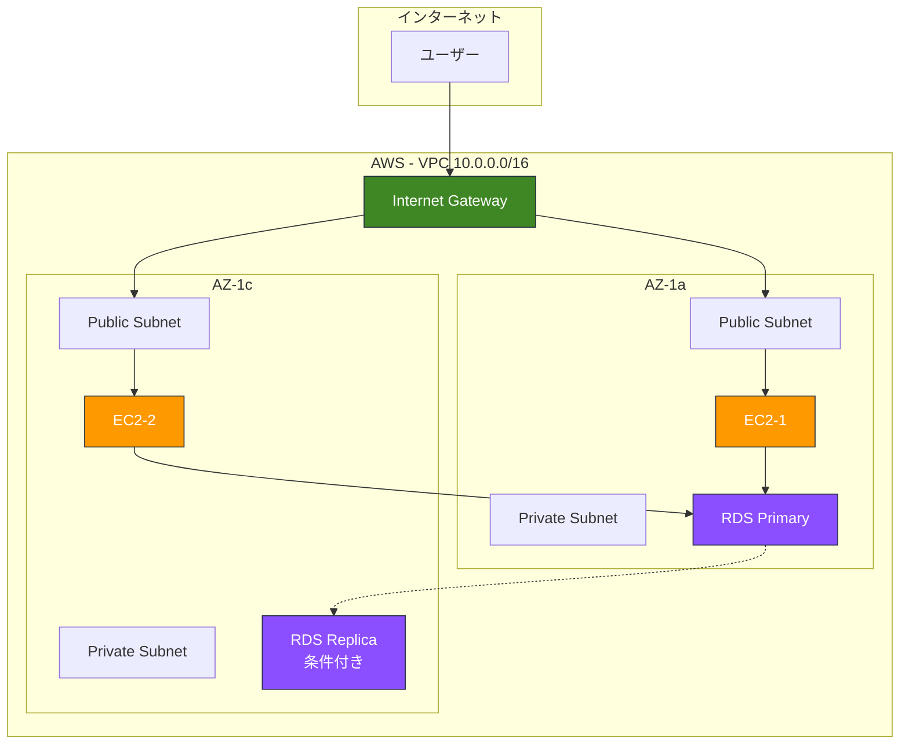

# CloudFormation Before/After 学習教材

組み込み関数・パラメータ化を使った洗練されたコードへの進化を学ぶ

---

## 📚 この教材について

### 目的

CloudFormationの**初心者コード**（ベタ書き）から**中級者コード**（組み込み関数・パラメータ活用）への進化を、実際のコードで学びます。

### 対象者

- CloudFormationの基本構文は理解している
- 組み込み関数の使い方を実践で学びたい
- パラメータ化・Output・スタック間連携を習得したい
- 保守性の高いテンプレートを書けるようになりたい

---

## 📁 ファイル構成

```
cfn-text/
├── README-before-after.md              ← このファイル
├── before-after-comparison.md          ← 概要・比較表
├── before-basic.yaml                   ← Before版（ベタ書き）
├── after-advanced.yaml                 ← After版（洗練版）
├── import-example.yaml                 ← ImportValue 使用例
└── deployment-guide.md                 ← デプロイ手順
```

---

## 🎯 学習の流れ

### Step 1: Before版を読む（15分）

**ファイル**: `before-basic.yaml`

**学習ポイント**:
- ❌ すべてハードコードの問題点
- ❌ 重複コードの保守性の低さ
- ❌ 環境変更の困難さ
- ❌ スタック間連携の不可能性

**確認すべき箇所**:
```yaml
# ❌ ハードコード例
VpcId: vpc-xxxxx                    # 実際には動作しない
ImageId: ami-0c3fd0f5d33134a76      # リージョン・時期依存
BucketName: myapp-dev-bucket        # 環境変更時に全修正必要
```

### Step 2: After版を読む（30分）

**ファイル**: `after-advanced.yaml`

**学習ポイント**:
- ✅ Parameters による柔軟性
- ✅ Mappings による環境別設定
- ✅ Conditions による条件分岐
- ✅ 組み込み関数による重複排除
- ✅ Outputs による再利用性
- ✅ 疑似パラメータによる自動化

**重要な組み込み関数**:
```yaml
!Ref VPC                                    # リソース参照
!GetAtt WebServer.PublicIp                  # 属性取得
!Sub '${ProjectName}-${Environment}-vpc'    # 変数展開
!Select [0, !GetAZs '']                     # AZ自動取得
!FindInMap [EnvironmentConfig, !Ref Environment, InstanceType]  # Mappings参照
!If [IsProduction, m5.large, t3.small]      # 条件分岐
!Join [',', [!Ref Subnet1, !Ref Subnet2]]   # 文字列結合
```

### Step 3: 比較表で違いを理解（10分）

**ファイル**: `before-after-comparison.md`

**比較ポイント**:

| 項目 | Before | After | 改善効果 |
|------|--------|-------|---------|
| **環境変更** | 全箇所修正 | パラメータ1箇所 | 10倍以上の効率化 |
| **リージョン変更** | AMI等全修正 | 自動対応 | 完全自動化 |
| **スタック連携** | 不可 | 可能 | 再利用性向上 |
| **保守性** | 低い | 高い | バグ減少 |

### Step 4: 実際にデプロイ（30分）

**ファイル**: `deployment-guide.md`

**実行手順**:
```bash
# 1. After版をデプロイ（開発環境）
aws cloudformation create-stack \
  --stack-name myapp-dev-stack \
  --template-body file://after-advanced.yaml \
  --parameters \
    ParameterKey=Environment,ParameterValue=dev \
    ParameterKey=DBPassword,ParameterValue=SecurePass123!

# 2. 出力値確認
aws cloudformation describe-stacks \
  --stack-name myapp-dev-stack \
  --query 'Stacks[0].Outputs'

# 3. Web Serverにアクセス
curl http://<WebServer1PublicIP>
```

### Step 5: ImportValue を体験（20分）

**ファイル**: `import-example.yaml`

**学習ポイント**:
- Outputs + Export の使い方
- ImportValue でスタック間連携
- デプロイ・削除の順序の重要性

---

## 🔑 習得できる中級テクニック

### 1. Parameters（パラメータ化）

**Before**:
```yaml
BucketName: myapp-dev-bucket    # ハードコード
```

**After**:
```yaml
Parameters:
  ProjectName:
    Type: String
  Environment:
    Type: String

Resources:
  Bucket:
    Properties:
      BucketName: !Sub '${ProjectName}-${Environment}-bucket'
```

**効果**: 環境変更が1箇所で完結

---

### 2. Mappings（環境別設定）

**Before**:
```yaml
InstanceType: t3.small    # 開発・本番で同じ
```

**After**:
```yaml
Mappings:
  EnvironmentConfig:
    dev:
      InstanceType: t3.small
    prod:
      InstanceType: m5.large

Resources:
  Instance:
    Properties:
      InstanceType: !FindInMap [EnvironmentConfig, !Ref Environment, InstanceType]
```

**効果**: 環境に応じた自動切り替え

---

### 3. Conditions（条件分岐）

**Before**:
```yaml
# Read Replicaを常に作成（コスト増）
ReadReplica:
  Type: AWS::RDS::DBInstance
```

**After**:
```yaml
Conditions:
  ShouldCreateReadReplica: !Equals [!Ref CreateReadReplica, 'true']

Resources:
  ReadReplica:
    Type: AWS::RDS::DBInstance
    Condition: ShouldCreateReadReplica    # 条件付き作成
```

**効果**: リソースの条件付き作成でコスト最適化

---

### 4. 組み込み関数（重複排除）

**Before**:
```yaml
VpcId: vpc-xxxxx    # 20箇所で同じ値を記述
```

**After**:
```yaml
VpcId: !Ref VPC    # 一度定義して参照
```

**効果**: 保守性向上、バグ減少

---

### 5. Outputs + Export（スタック間連携）

**Before**:
```yaml
# 他のスタックで値を再利用できない
```

**After**:
```yaml
Outputs:
  VpcId:
    Value: !Ref VPC
    Export:
      Name: !Sub '${AWS::StackName}-VPC'

# 他のスタックで使用
Resources:
  Instance:
    Properties:
      SubnetId: !ImportValue NetworkStack-VPC
```

**効果**: スタック分割・再利用が可能に

---

### 6. 疑似パラメータ（自動化）

**Before**:
```yaml
AvailabilityZone: ap-northeast-1a    # リージョン依存
```

**After**:
```yaml
AvailabilityZone: !Select [0, !GetAZs '']    # 自動取得
```

**効果**: リージョン変更時も自動対応

---

## 📊 構成図



---

## 💰 コスト比較

### Before版（想定）
- 固定構成のみ
- 開発・本番で同じリソース
- **月額約$400**（無駄が多い）

### After版
- 環境別に最適化
- 開発: $60/月
- 本番: $740/月
- **合計約$800/月**（適切なリソース配分）

---

## 🎓 学習チェックリスト

### 基礎理解
- [ ] Before版の問題点を5つ以上説明できる
- [ ] Parameters の使い方を理解した
- [ ] Mappings で環境別設定ができる
- [ ] Conditions で条件分岐ができる

### 組み込み関数
- [ ] !Ref の使い方を理解した
- [ ] !GetAtt で属性取得ができる
- [ ] !Sub で変数展開ができる
- [ ] !Select と !GetAZs でAZ自動取得ができる
- [ ] !FindInMap でMappings参照ができる
- [ ] !If で条件分岐ができる
- [ ] !Join でリスト結合ができる

### スタック間連携
- [ ] Outputs + Export の使い方を理解した
- [ ] ImportValue で他スタック参照ができる
- [ ] デプロイ・削除の順序を理解した

### 実践
- [ ] After版を実際にデプロイした
- [ ] Parameters を変更して再デプロイした
- [ ] import-example.yaml を実行した
- [ ] 自分のプロジェクトに応用できる

---

## 🚨 よくある質問

### Q1: CloudFormationに for-each はありますか？

**A**: 直接的な for-each はありません。代わりに：
- **ネストスタック**で繰り返しパターンを実装
- **マクロ**（Transform）でテンプレート生成時に展開
- **外部ツール**（CDK、Terraformなど）で生成

### Q2: After版の方が長いのでは？

**A**: 1つのテンプレートでは長くなりますが：
- **再利用性**が高い（他環境にも使える）
- **保守コスト**が大幅削減
- **バグが少ない**

### Q3: ImportValue の制約は？

**A**: 
- Export名はリージョン内で一意
- Import使用中はExport削除不可
- Export名変更は影響大

---

## 📚 次のステップ

1. ✅ この教材を完全習得
2. ✅ ネストスタックを学ぶ（`02-nested-stacks-pattern.md`）
3. ✅ 変更セットを学ぶ（`03-change-sets.md`）
4. ✅ CI/CD統合を学ぶ（`11-cicd-integration.md`）
5. ✅ 自分のプロジェクトで実践

---

## 🔗 関連資料

- [00-cloudformation-cheatsheet.md](./00-cloudformation-cheatsheet.md) - 組み込み関数詳細
- [99-complete-textbook.md](./99-complete-textbook.md) - CloudFormation完全教科書
- [08-sample-templates.md](./08-sample-templates.md) - 実践サンプル集

---

**このBefore/After教材で、CloudFormation中級テクニックを完全習得！🚀**
