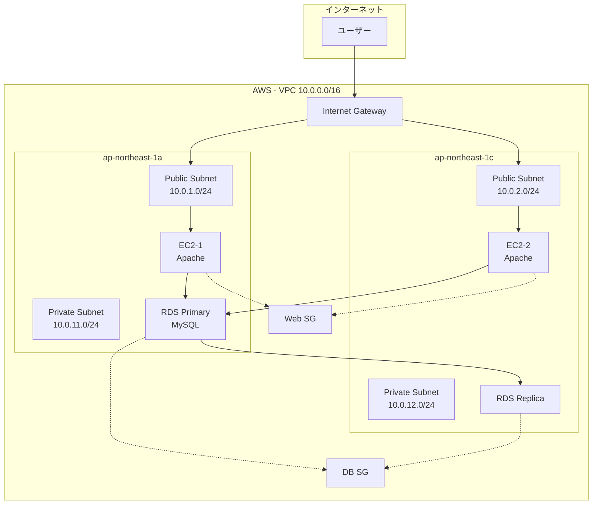

# CloudFormation Before/After 比較

組み込み関数・パラメータ化・Output等を使った洗練されたコードへの進化

---

## 📊 構成概要

### リソース構成



---

## 🔴 Before: ベタ書き版（初心者コード）

### 問題点

- ❌ すべてハードコード（環境変更が困難）
- ❌ 重複コードが多い
- ❌ 保守性が低い
- ❌ 他のスタックと連携不可
- ❌ リージョン変更時に全修正必要
- ❌ 環境（dev/prod）の切り替え不可

### ファイル: `before-basic.yaml`

---

## 🟢 After: 洗練版（中級者コード）

### 改善点

- ✅ パラメータ化（環境変更が容易）
- ✅ 組み込み関数で重複排除
- ✅ Mappings で環境別設定
- ✅ Conditions で条件分岐
- ✅ Outputs + Export でスタック間連携
- ✅ 疑似パラメータで自動値取得
- ✅ タグ戦略の統一

### 使用する中級テクニック

| 要素 | 用途 | 効果 |
|------|------|------|
| **Parameters** | 入力値の定義 | 環境・設定の柔軟な変更 |
| **Mappings** | 環境別設定マップ | dev/prod の自動切り替え |
| **Conditions** | 条件分岐 | リソースの条件付き作成 |
| **!Ref** | リソース参照 | 重複排除 |
| **!Sub** | 変数展開 | 動的な名前生成 |
| **!GetAtt** | 属性取得 | リソース詳細情報取得 |
| **!Join** | 文字列結合 | リスト値の結合 |
| **!Select** | 要素選択 | AZ選択等 |
| **!GetAZs** | AZ一覧取得 | リージョン依存排除 |
| **Outputs + Export** | スタック間連携 | 他スタックで値を再利用 |
| **DependsOn** | 依存関係明示 | 作成順序制御 |
| **疑似パラメータ** | AWS提供変数 | Region, AccountId等 |
| **DeletionPolicy** | 削除保護 | データ保護 |

### ファイル: `after-advanced.yaml`

---

## 📈 比較表

| 項目 | Before | After |
|------|--------|-------|
| **行数** | ~500行 | ~350行 |
| **環境変更** | 全箇所手動修正 | パラメータ1箇所 |
| **リージョン変更** | AMI等を全修正 | 自動対応 |
| **AZ指定** | ハードコード | 自動取得 |
| **スタック連携** | 不可 | 可能（Outputs） |
| **保守性** | 低い | 高い |
| **再利用性** | 低い | 高い |

---

## 🎯 学習ポイント

### 1. Parameters で柔軟性を確保

```yaml
# Before: ハードコード
BucketName: myapp-dev-bucket

# After: パラメータ化
BucketName: !Sub '${ProjectName}-${Environment}-bucket'
```

### 2. Mappings で環境別設定

```yaml
# 環境に応じて自動切り替え
Mappings:
  EnvironmentConfig:
    dev:
      InstanceType: t3.small
    prod:
      InstanceType: m5.large
```

### 3. Conditions で条件分岐

```yaml
# 本番環境のみリソース作成
Conditions:
  IsProduction: !Equals [!Ref Environment, prod]

Resources:
  ReadReplica:
    Type: AWS::RDS::DBInstance
    Condition: IsProduction
```

### 4. 組み込み関数で重複排除

```yaml
# Before: 同じ値を何度も記述
VpcId: vpc-xxxxx

# After: 一度定義して参照
VpcId: !Ref MyVPC
```

### 5. Outputs で再利用

```yaml
# このスタックの値を他スタックで使用可能
Outputs:
  VpcId:
    Value: !Ref VPC
    Export:
      Name: !Sub '${AWS::StackName}-VPC'
```

---

## 📚 次のステップ

1. ✅ Before版を実行して動作確認
2. ✅ After版を実行して比較
3. ✅ Parameters を変更して再デプロイ
4. ✅ 別スタックから Outputs を ImportValue
5. ✅ Conditions で本番/開発を切り替え

---

## 🔗 関連ファイル

- `before-basic.yaml` - ベタ書き版
- `after-advanced.yaml` - 洗練版
- `import-example.yaml` - ImportValue 使用例

---

**このBefore/Afterで、CloudFormation中級テクニックを完全習得！🚀**
